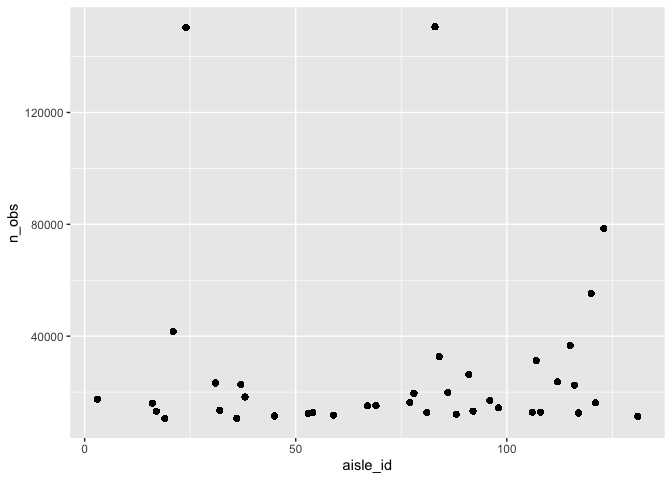

p8105_hw3_gw2442
================
2022-10-07

``` r
library(tidyverse)
```

    ## ── Attaching packages ─────────────────────────────────────── tidyverse 1.3.2 ──
    ## ✔ ggplot2 3.3.6      ✔ purrr   0.3.4 
    ## ✔ tibble  3.1.8      ✔ dplyr   1.0.10
    ## ✔ tidyr   1.2.0      ✔ stringr 1.4.1 
    ## ✔ readr   2.1.2      ✔ forcats 0.5.2 
    ## ── Conflicts ────────────────────────────────────────── tidyverse_conflicts() ──
    ## ✖ dplyr::filter() masks stats::filter()
    ## ✖ dplyr::lag()    masks stats::lag()

## Problem 1

``` r
library(p8105.datasets)
data("instacart")

instacart %>%
  group_by(aisle_id) %>%
  summarise(n_obs = n()) %>%
  arrange(desc(n_obs))
```

    ## # A tibble: 134 × 2
    ##    aisle_id  n_obs
    ##       <int>  <int>
    ##  1       83 150609
    ##  2       24 150473
    ##  3      123  78493
    ##  4      120  55240
    ##  5       21  41699
    ##  6      115  36617
    ##  7       84  32644
    ##  8      107  31269
    ##  9       91  26240
    ## 10      112  23635
    ## # … with 124 more rows

There are 134 aisle. The aisle with the most items ordered from were:

-   Aisle 83 with 150,609 items
-   Aisle 24 with 150,473 items
-   Aisle 123 with 78,493 items

``` r
instacart %>%
  group_by(aisle_id) %>%
  mutate(
    n_obs = n()
  ) %>%
  filter(n_obs > 10000) %>%
ggplot(aes(x = aisle_id, y = n_obs)) +
  geom_point()
```

<!-- -->

``` r
instacart %>%
  filter(aisle == c("baking ingredients", "dog food care", "packaged vegetables fruits")) %>%
  group_by(aisle, product_name) %>%
  summarise(n_obs = n()) 
```

    ## `summarise()` has grouped output by 'aisle'. You can override using the
    ## `.groups` argument.

    ## # A tibble: 1,114 × 3
    ## # Groups:   aisle [3]
    ##    aisle              product_name                                    n_obs
    ##    <chr>              <chr>                                           <int>
    ##  1 baking ingredients 1 to 1 Gluten Free Baking Flour                     5
    ##  2 baking ingredients 1-to-1 Baking Flour, Gluten/Wheat/Dairy Free        2
    ##  3 baking ingredients 100% Cacao Unsweetened Chocolate Baking Bar         3
    ##  4 baking ingredients 100% Natural Sweetener Zero Calorie Packets        16
    ##  5 baking ingredients 100% Natural Zero Calorie Sweetener                 2
    ##  6 baking ingredients 100% Organic Einkorn  All-Purpose Flour             2
    ##  7 baking ingredients 100% Organic Premium Whole Wheat Flour              2
    ##  8 baking ingredients 100% Organic Unbleached All-Purpose Flour           8
    ##  9 baking ingredients 100% Organic Unbleached White Whole Wheat Flour     1
    ## 10 baking ingredients 100% Pure Corn Starch                              22
    ## # … with 1,104 more rows

## Problem 2

Loading, tidying, and wrangling the dataset:

``` r
accel_data = read_csv("data/accel_data.csv") %>%
  janitor::clean_names() %>%
  mutate(
    day_type = ifelse(day %in% c("Saturday", "Sunday"), "weekend", "weekday")) %>%
  select(week, day_id, day, day_type, everything()) %>%
  pivot_longer(
    activity_1:activity_1440,
    names_to = "activity_number",
    names_prefix = "activity_",
    names_transform = list(activity_number = as.numeric),
    values_to = "activity_count_min"
  ) 
```

    ## Rows: 35 Columns: 1443
    ## ── Column specification ────────────────────────────────────────────────────────
    ## Delimiter: ","
    ## chr    (1): day
    ## dbl (1442): week, day_id, activity.1, activity.2, activity.3, activity.4, ac...
    ## 
    ## ℹ Use `spec()` to retrieve the full column specification for this data.
    ## ℹ Specify the column types or set `show_col_types = FALSE` to quiet this message.

``` r
skimr::skim(accel_data)
```

|                                                  |            |
|:-------------------------------------------------|:-----------|
| Name                                             | accel_data |
| Number of rows                                   | 50400      |
| Number of columns                                | 6          |
| \_\_\_\_\_\_\_\_\_\_\_\_\_\_\_\_\_\_\_\_\_\_\_   |            |
| Column type frequency:                           |            |
| character                                        | 2          |
| numeric                                          | 4          |
| \_\_\_\_\_\_\_\_\_\_\_\_\_\_\_\_\_\_\_\_\_\_\_\_ |            |
| Group variables                                  | None       |

Data summary

**Variable type: character**

| skim_variable | n_missing | complete_rate | min | max | empty | n_unique | whitespace |
|:--------------|----------:|--------------:|----:|----:|------:|---------:|-----------:|
| day           |         0 |             1 |   6 |   9 |     0 |        7 |          0 |
| day_type      |         0 |             1 |   7 |   7 |     0 |        2 |          0 |

**Variable type: numeric**

| skim_variable      | n_missing | complete_rate |   mean |     sd |  p0 |    p25 |   p50 |     p75 | p100 | hist  |
|:-------------------|----------:|--------------:|-------:|-------:|----:|-------:|------:|--------:|-----:|:------|
| week               |         0 |             1 |   3.00 |   1.41 |   1 |   2.00 |   3.0 |    4.00 |    5 | ▇▇▇▇▇ |
| day_id             |         0 |             1 |  18.00 |  10.10 |   1 |   9.00 |  18.0 |   27.00 |   35 | ▇▇▇▇▇ |
| activity_number    |         0 |             1 | 720.50 | 415.70 |   1 | 360.75 | 720.5 | 1080.25 | 1440 | ▇▇▇▇▇ |
| activity_count_min |         0 |             1 | 267.04 | 443.16 |   1 |   1.00 |  74.0 |  364.00 | 8982 | ▇▁▁▁▁ |

The dataset consists of the following variables: week, day_id, day,
day_type, activity_number, and activity_count_min. All variables are
numeric variables except for day and day_type. The dataset is made up of
50400 rows and 6 columns.

``` r
accel_data %>%
  group_by(day_id) %>%
  mutate(
    activity_total = sum(activity_count_min)
  ) %>%
  summarise(day, activity_total) %>%
  distinct %>%
  print(n = 35)
```

    ## `summarise()` has grouped output by 'day_id'. You can override using the
    ## `.groups` argument.

    ## # A tibble: 35 × 3
    ## # Groups:   day_id [35]
    ##    day_id day       activity_total
    ##     <dbl> <chr>              <dbl>
    ##  1      1 Friday           480543.
    ##  2      2 Monday            78828.
    ##  3      3 Saturday         376254 
    ##  4      4 Sunday           631105 
    ##  5      5 Thursday         355924.
    ##  6      6 Tuesday          307094.
    ##  7      7 Wednesday        340115.
    ##  8      8 Friday           568839 
    ##  9      9 Monday           295431 
    ## 10     10 Saturday         607175 
    ## 11     11 Sunday           422018 
    ## 12     12 Thursday         474048 
    ## 13     13 Tuesday          423245 
    ## 14     14 Wednesday        440962 
    ## 15     15 Friday           467420 
    ## 16     16 Monday           685910 
    ## 17     17 Saturday         382928 
    ## 18     18 Sunday           467052 
    ## 19     19 Thursday         371230 
    ## 20     20 Tuesday          381507 
    ## 21     21 Wednesday        468869 
    ## 22     22 Friday           154049 
    ## 23     23 Monday           409450 
    ## 24     24 Saturday           1440 
    ## 25     25 Sunday           260617 
    ## 26     26 Thursday         340291 
    ## 27     27 Tuesday          319568 
    ## 28     28 Wednesday        434460 
    ## 29     29 Friday           620860 
    ## 30     30 Monday           389080 
    ## 31     31 Saturday           1440 
    ## 32     32 Sunday           138421 
    ## 33     33 Thursday         549658 
    ## 34     34 Tuesday          367824 
    ## 35     35 Wednesday        445366

From this table, there are no obvious trends apparent. However, two of
the Saturdays (day_id = 24, 31) both have a total activity of 1440
minutes.

## Problem 3

``` r
library(p8105.datasets)
data("ny_noaa")

problem_3 = ny_noaa %>%
  janitor::clean_names() %>%
  separate(date, c("year", "month", "day"), sep = "-") %>%
  mutate(
    prcp = prcp*10
  )
```
