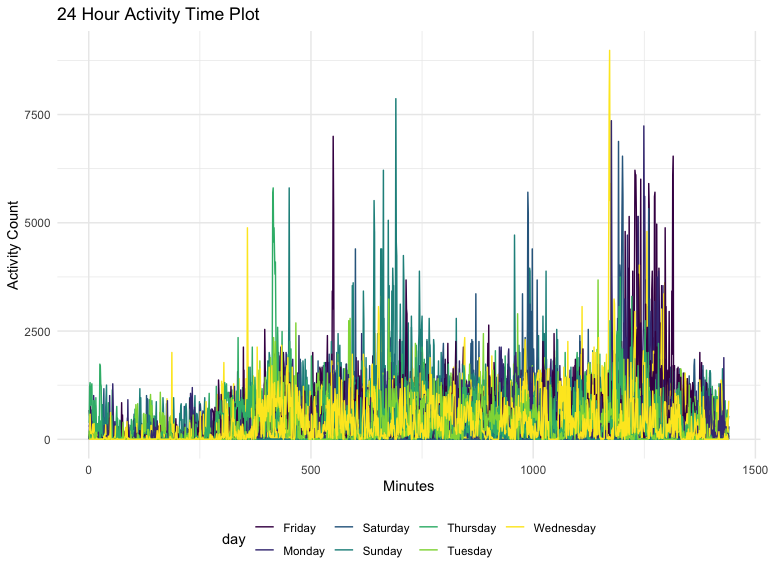
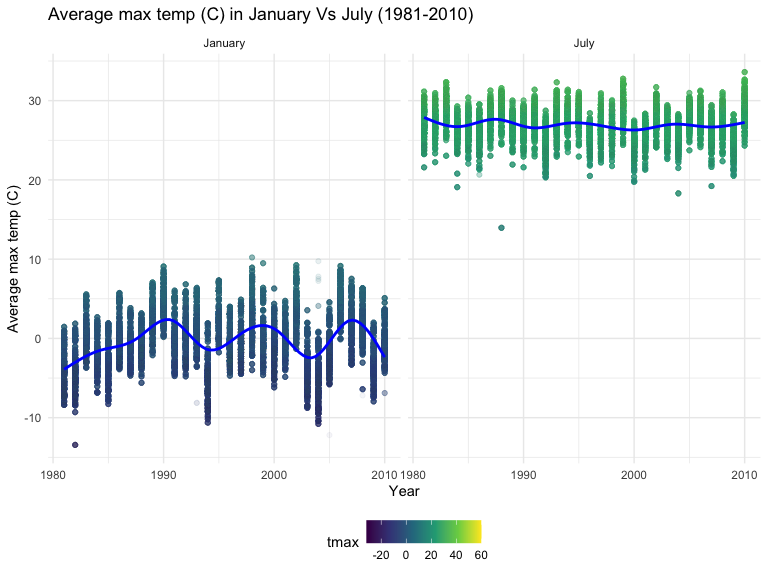
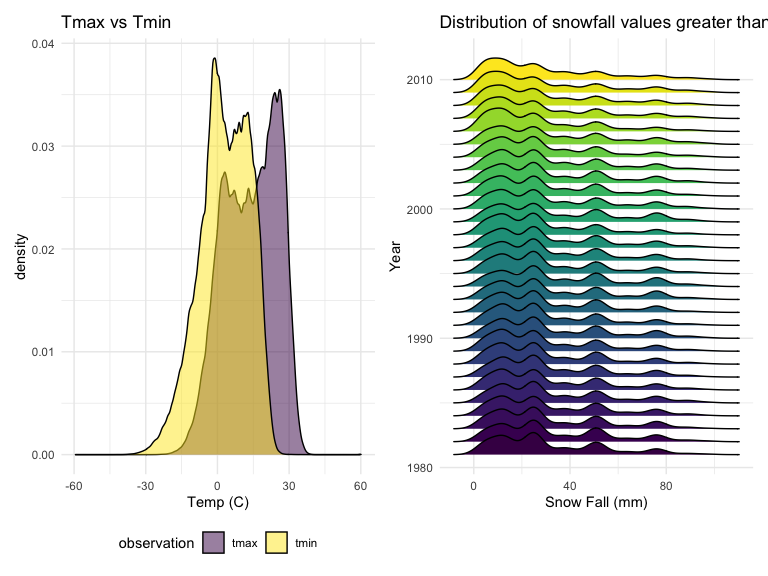

p8105_hw3_gw2442
================
2022-10-07

``` r
library(tidyverse)
```

    ## ── Attaching packages ─────────────────────────────────────── tidyverse 1.3.2 ──
    ## ✔ ggplot2 3.3.6      ✔ purrr   0.3.4 
    ## ✔ tibble  3.1.8      ✔ dplyr   1.0.10
    ## ✔ tidyr   1.2.0      ✔ stringr 1.4.1 
    ## ✔ readr   2.1.2      ✔ forcats 0.5.2 
    ## ── Conflicts ────────────────────────────────────────── tidyverse_conflicts() ──
    ## ✖ dplyr::filter() masks stats::filter()
    ## ✖ dplyr::lag()    masks stats::lag()

``` r
library(dplyr)
library(patchwork)
library(ggridges)
library(p8105.datasets)

knitr::opts_chunk$set(
    echo = TRUE,
    warning = FALSE,
    fig.width = 8, 
  fig.height = 6,
  out.width = "90%"
)

theme_set(theme_minimal() + theme(legend.position = "bottom"))

options(
  ggplot2.continuous.colour = "viridis",
  ggplot2.continuous.fill = "viridis"
)

scale_colour_discrete = scale_colour_viridis_d
scale_fill_discrete = scale_fill_viridis_d
```

## Problem 1

``` r
data("instacart")

instacart = 
  instacart %>% 
  as_tibble(instacart)
```

This dataset contains 11384617 rows and 15 columns. Each row represents
a single item from an instacart order. The variables in the dataset
pertain to information such as identifiers for user, the order in which
each product was added to the cart, number of days since prior order,
product name, aisle the product belongs in, and so on. The variables
within this dataset are specifically as follows: `order_id`,
`product_id`, `add_to_cart_order`, `reordered`, `user_id`, `eval_set`,
`order_number`, `order_dow`, `order_hour_of_day`,
`days_since_prior_order`, `product_name`, `aisle_id`, `department_id`,
`aisle`, and `department`. In total, there are 39123 products found in
131209 orders from 131209 distinct users.

``` r
instacart %>%
  group_by(aisle_id) %>%
  summarise(n_obs = n()) %>%
  arrange(desc(n_obs))
```

    ## # A tibble: 134 × 2
    ##    aisle_id  n_obs
    ##       <int>  <int>
    ##  1       83 150609
    ##  2       24 150473
    ##  3      123  78493
    ##  4      120  55240
    ##  5       21  41699
    ##  6      115  36617
    ##  7       84  32644
    ##  8      107  31269
    ##  9       91  26240
    ## 10      112  23635
    ## # … with 124 more rows

There are 134 aisles. The aisle with the most items ordered from were:

-   Aisle 83 with 150,609 items
-   Aisle 24 with 150,473 items
-   Aisle 123 with 78,493 items

This is a plot showing the number of items ordered in each aisle,
limited to aisle with more than 1000 items ordered:

``` r
instacart %>% 
  count(aisle) %>% 
  filter(n > 10000) %>% 
  mutate(aisle = fct_reorder(aisle, n)) %>% 
  ggplot(aes(x = aisle, y = n)) + 
  geom_point() + 
  labs(title = "Number of items ordered in each aisle") +
  theme(axis.text.x = element_text(angle = 60, hjust = 1))
```


This is a table showing the three most popular items in each of the
aisles “baking ingredients”, “dog food care”, and “packaged vegetables
fruits”:

``` r
instacart %>% 
  filter(aisle %in% c("baking ingredients", "dog food care", "packaged vegetables fruits")) %>%
  group_by(aisle) %>% 
  count(product_name) %>% 
  mutate(rank = min_rank(desc(n))) %>% 
  filter(rank < 4) %>% 
  arrange(desc(n)) %>%
  knitr::kable()
```

| aisle                      | product_name                                  |    n | rank |
|:---------------------------|:----------------------------------------------|-----:|-----:|
| packaged vegetables fruits | Organic Baby Spinach                          | 9784 |    1 |
| packaged vegetables fruits | Organic Raspberries                           | 5546 |    2 |
| packaged vegetables fruits | Organic Blueberries                           | 4966 |    3 |
| baking ingredients         | Light Brown Sugar                             |  499 |    1 |
| baking ingredients         | Pure Baking Soda                              |  387 |    2 |
| baking ingredients         | Cane Sugar                                    |  336 |    3 |
| dog food care              | Snack Sticks Chicken & Rice Recipe Dog Treats |   30 |    1 |
| dog food care              | Organix Chicken & Brown Rice Recipe           |   28 |    2 |
| dog food care              | Small Dog Biscuits                            |   26 |    3 |

This is a table showing the mean hour of the day at which Pink Lady
Apples and Coffee Ice Cream are ordered ine ach day of the week:

``` r
instacart %>%
  filter(product_name %in% c("Pink Lady Apples", "Coffee Ice Cream")) %>%
  group_by(product_name, order_dow) %>%
  summarize(mean_hour = mean(order_hour_of_day)) %>%
  spread(key = order_dow, value = mean_hour) %>%
  knitr::kable(digits = 2)
```

    ## `summarise()` has grouped output by 'product_name'. You can override using the
    ## `.groups` argument.

| product_name     |     0 |     1 |     2 |     3 |     4 |     5 |     6 |
|:-----------------|------:|------:|------:|------:|------:|------:|------:|
| Coffee Ice Cream | 13.77 | 14.32 | 15.38 | 15.32 | 15.22 | 12.26 | 13.83 |
| Pink Lady Apples | 13.44 | 11.36 | 11.70 | 14.25 | 11.55 | 12.78 | 11.94 |

## Problem 2

Loading, tidying, and wrangling the dataset:

``` r
accel_data = read_csv("data/accel_data.csv") %>%
  janitor::clean_names() %>%
  mutate(
    day_type = ifelse(day %in% c("Saturday", "Sunday"), "weekend", "weekday")) %>%
  select(week, day_id, day, day_type, everything()) %>%
  pivot_longer(
    activity_1:activity_1440,
    names_to = "activity_number",
    names_prefix = "activity_",
    names_transform = list(activity_number = as.numeric),
    values_to = "activity_count_min"
  ) 
```

    ## Rows: 35 Columns: 1443
    ## ── Column specification ────────────────────────────────────────────────────────
    ## Delimiter: ","
    ## chr    (1): day
    ## dbl (1442): week, day_id, activity.1, activity.2, activity.3, activity.4, ac...
    ## 
    ## ℹ Use `spec()` to retrieve the full column specification for this data.
    ## ℹ Specify the column types or set `show_col_types = FALSE` to quiet this message.

``` r
skimr::skim(accel_data)
```

|                                                  |            |
|:-------------------------------------------------|:-----------|
| Name                                             | accel_data |
| Number of rows                                   | 50400      |
| Number of columns                                | 6          |
| \_\_\_\_\_\_\_\_\_\_\_\_\_\_\_\_\_\_\_\_\_\_\_   |            |
| Column type frequency:                           |            |
| character                                        | 2          |
| numeric                                          | 4          |
| \_\_\_\_\_\_\_\_\_\_\_\_\_\_\_\_\_\_\_\_\_\_\_\_ |            |
| Group variables                                  | None       |

Data summary

**Variable type: character**

| skim_variable | n_missing | complete_rate | min | max | empty | n_unique | whitespace |
|:--------------|----------:|--------------:|----:|----:|------:|---------:|-----------:|
| day           |         0 |             1 |   6 |   9 |     0 |        7 |          0 |
| day_type      |         0 |             1 |   7 |   7 |     0 |        2 |          0 |

**Variable type: numeric**

| skim_variable      | n_missing | complete_rate |   mean |     sd |  p0 |    p25 |   p50 |     p75 | p100 | hist  |
|:-------------------|----------:|--------------:|-------:|-------:|----:|-------:|------:|--------:|-----:|:------|
| week               |         0 |             1 |   3.00 |   1.41 |   1 |   2.00 |   3.0 |    4.00 |    5 | ▇▇▇▇▇ |
| day_id             |         0 |             1 |  18.00 |  10.10 |   1 |   9.00 |  18.0 |   27.00 |   35 | ▇▇▇▇▇ |
| activity_number    |         0 |             1 | 720.50 | 415.70 |   1 | 360.75 | 720.5 | 1080.25 | 1440 | ▇▇▇▇▇ |
| activity_count_min |         0 |             1 | 267.04 | 443.16 |   1 |   1.00 |  74.0 |  364.00 | 8982 | ▇▁▁▁▁ |

The dataset consists of the following variables: week, day_id, day,
day_type, activity_number, and activity_count_min. All variables are
numeric variables except for day and day_type. The dataset is made up of
50400 rows and 6 columns.

This is a table showing the total minutes of activity for each day:

``` r
accel_data %>%
  group_by(day_id) %>%
  mutate(
    activity_total = sum(activity_count_min)
  ) %>%
  summarise(day, activity_total) %>%
  distinct %>%
  print(n = 35) %>%
  knitr::kable()
```

    ## `summarise()` has grouped output by 'day_id'. You can override using the
    ## `.groups` argument.

    ## # A tibble: 35 × 3
    ## # Groups:   day_id [35]
    ##    day_id day       activity_total
    ##     <dbl> <chr>              <dbl>
    ##  1      1 Friday           480543.
    ##  2      2 Monday            78828.
    ##  3      3 Saturday         376254 
    ##  4      4 Sunday           631105 
    ##  5      5 Thursday         355924.
    ##  6      6 Tuesday          307094.
    ##  7      7 Wednesday        340115.
    ##  8      8 Friday           568839 
    ##  9      9 Monday           295431 
    ## 10     10 Saturday         607175 
    ## 11     11 Sunday           422018 
    ## 12     12 Thursday         474048 
    ## 13     13 Tuesday          423245 
    ## 14     14 Wednesday        440962 
    ## 15     15 Friday           467420 
    ## 16     16 Monday           685910 
    ## 17     17 Saturday         382928 
    ## 18     18 Sunday           467052 
    ## 19     19 Thursday         371230 
    ## 20     20 Tuesday          381507 
    ## 21     21 Wednesday        468869 
    ## 22     22 Friday           154049 
    ## 23     23 Monday           409450 
    ## 24     24 Saturday           1440 
    ## 25     25 Sunday           260617 
    ## 26     26 Thursday         340291 
    ## 27     27 Tuesday          319568 
    ## 28     28 Wednesday        434460 
    ## 29     29 Friday           620860 
    ## 30     30 Monday           389080 
    ## 31     31 Saturday           1440 
    ## 32     32 Sunday           138421 
    ## 33     33 Thursday         549658 
    ## 34     34 Tuesday          367824 
    ## 35     35 Wednesday        445366

| day_id | day       | activity_total |
|-------:|:----------|---------------:|
|      1 | Friday    |      480542.62 |
|      2 | Monday    |       78828.07 |
|      3 | Saturday  |      376254.00 |
|      4 | Sunday    |      631105.00 |
|      5 | Thursday  |      355923.64 |
|      6 | Tuesday   |      307094.24 |
|      7 | Wednesday |      340115.01 |
|      8 | Friday    |      568839.00 |
|      9 | Monday    |      295431.00 |
|     10 | Saturday  |      607175.00 |
|     11 | Sunday    |      422018.00 |
|     12 | Thursday  |      474048.00 |
|     13 | Tuesday   |      423245.00 |
|     14 | Wednesday |      440962.00 |
|     15 | Friday    |      467420.00 |
|     16 | Monday    |      685910.00 |
|     17 | Saturday  |      382928.00 |
|     18 | Sunday    |      467052.00 |
|     19 | Thursday  |      371230.00 |
|     20 | Tuesday   |      381507.00 |
|     21 | Wednesday |      468869.00 |
|     22 | Friday    |      154049.00 |
|     23 | Monday    |      409450.00 |
|     24 | Saturday  |        1440.00 |
|     25 | Sunday    |      260617.00 |
|     26 | Thursday  |      340291.00 |
|     27 | Tuesday   |      319568.00 |
|     28 | Wednesday |      434460.00 |
|     29 | Friday    |      620860.00 |
|     30 | Monday    |      389080.00 |
|     31 | Saturday  |        1440.00 |
|     32 | Sunday    |      138421.00 |
|     33 | Thursday  |      549658.00 |
|     34 | Tuesday   |      367824.00 |
|     35 | Wednesday |      445366.00 |

From this table, there are no obvious trends apparent. However, two of
the Saturdays (day_id = 24, 31) both have a total activity of 1440
minutes.

This is a single-panel plot showing the 24-hour activity time courses
for each day, differentiated by the day of the week:

``` r
  accel_data %>%
  ggplot(aes(x = activity_number, y = activity_count_min, color = day)) + 
  geom_line(aes(group = day_id)) +
  labs(
    title = "24 Hour Activity Time Plot",
    x = "Minutes",
    y = "Activity Count"
  )
```



From this plot, Sundays seem to exhibit a spike in activity around
minute 400 of the day. Saturday’s and Sunday’s exhibit a spike in
activity around minute 700 and minute 1000. There seems to be a spike in
activity across all days of the week around minute 1250.

## Problem 3

Description of the dataset

``` r
data("ny_noaa")
skimr::skim(ny_noaa)
```

|                                                  |         |
|:-------------------------------------------------|:--------|
| Name                                             | ny_noaa |
| Number of rows                                   | 2595176 |
| Number of columns                                | 7       |
| \_\_\_\_\_\_\_\_\_\_\_\_\_\_\_\_\_\_\_\_\_\_\_   |         |
| Column type frequency:                           |         |
| character                                        | 3       |
| Date                                             | 1       |
| numeric                                          | 3       |
| \_\_\_\_\_\_\_\_\_\_\_\_\_\_\_\_\_\_\_\_\_\_\_\_ |         |
| Group variables                                  | None    |

Data summary

**Variable type: character**

| skim_variable | n_missing | complete_rate | min | max | empty | n_unique | whitespace |
|:--------------|----------:|--------------:|----:|----:|------:|---------:|-----------:|
| id            |         0 |          1.00 |  11 |  11 |     0 |      747 |          0 |
| tmax          |   1134358 |          0.56 |   1 |   4 |     0 |      532 |          0 |
| tmin          |   1134420 |          0.56 |   1 |   4 |     0 |      548 |          0 |

**Variable type: Date**

| skim_variable | n_missing | complete_rate | min        | max        | median     | n_unique |
|:--------------|----------:|--------------:|:-----------|:-----------|:-----------|---------:|
| date          |         0 |             1 | 1981-01-01 | 2010-12-31 | 1997-01-21 |    10957 |

**Variable type: numeric**

| skim_variable | n_missing | complete_rate |  mean |     sd |  p0 | p25 | p50 | p75 |  p100 | hist  |
|:--------------|----------:|--------------:|------:|-------:|----:|----:|----:|----:|------:|:------|
| prcp          |    145838 |          0.94 | 29.82 |  78.18 |   0 |   0 |   0 |  23 | 22860 | ▇▁▁▁▁ |
| snow          |    381221 |          0.85 |  4.99 |  27.22 | -13 |   0 |   0 |   0 | 10160 | ▇▁▁▁▁ |
| snwd          |    591786 |          0.77 | 37.31 | 113.54 |   0 |   0 |   0 |   0 |  9195 | ▇▁▁▁▁ |

There are 2595176 rows and 7 columns in this dataset. The variables
within the dataset are: id, date, prcp, snow, snwd, tmax, and tmin.
There are 1134358 missing data points for tmax, 1134420 missing data
points for tmin, 145838 missing data poitns for prcp, 381221 missing
data points for snow, and 591786 missing data points for snwd.

Data cleaning:

``` r
problem_3 = 
ny_noaa %>%
  janitor::clean_names() %>%
  separate(date, c("year", "month", "day"), sep = "-") %>%
  mutate(
    year = as.numeric(year),
    month = as.numeric(month),
    day = as.numeric(day),
    prcp = prcp/10,
    tmax = as.numeric(tmax),
    tmin = as.numeric(tmin),
    tmax = tmax/10,
    tmin = tmin/10
  ) 

problem_3 %>%
  count(snow, name = "n_obs_snow") %>%
  arrange(desc(n_obs_snow)) %>%
  knitr::kable()
```

|  snow | n_obs_snow |
|------:|-----------:|
|     0 |    2008508 |
|    NA |     381221 |
|    25 |      31022 |
|    13 |      23095 |
|    51 |      18274 |
|    76 |      10173 |
|     8 |       9962 |
|     5 |       9748 |
|    38 |       9197 |
|     3 |       8790 |
|   102 |       6552 |
|    10 |       5106 |
|    20 |       4797 |
|    64 |       4506 |
|   127 |       3901 |
|    15 |       3672 |
|    18 |       3226 |
|   152 |       3131 |
|    30 |       2814 |
|    89 |       2535 |
|    33 |       2380 |
|    46 |       2123 |
|    28 |       2118 |
|    23 |       1959 |
|   178 |       1650 |
|    36 |       1630 |
|   114 |       1578 |
|   203 |       1475 |
|    41 |       1467 |
|    43 |       1337 |
|    58 |       1198 |
|    56 |       1179 |
|    53 |       1155 |
|    71 |       1075 |
|   140 |        994 |
|    48 |        918 |
|    61 |        849 |
|    81 |        811 |
|    66 |        790 |
|   254 |        786 |
|   229 |        744 |
|    69 |        726 |
|    97 |        704 |
|    79 |        635 |
|   165 |        614 |
|    84 |        553 |
|   107 |        504 |
|    86 |        476 |
|    74 |        463 |
|   305 |        451 |
|    91 |        428 |
|   191 |        426 |
|   122 |        411 |
|    94 |        404 |
|   109 |        393 |
|   279 |        369 |
|   104 |        349 |
|   132 |        310 |
|   216 |        292 |
|    99 |        276 |
|   117 |        276 |
|   147 |        268 |
|   135 |        253 |
|   119 |        248 |
|   112 |        243 |
|   356 |        235 |
|   330 |        226 |
|   130 |        217 |
|   157 |        209 |
|   241 |        192 |
|   142 |        187 |
|   173 |        187 |
|   155 |        186 |
|   124 |        183 |
|   137 |        173 |
|   145 |        172 |
|   160 |        149 |
|   381 |        139 |
|   163 |        133 |
|   183 |        132 |
|   198 |        130 |
|   267 |        130 |
|   150 |        124 |
|   185 |        117 |
|   406 |        116 |
|   168 |        115 |
|   170 |        104 |
|   457 |        100 |
|   208 |         98 |
|   180 |         93 |
|   292 |         81 |
|   175 |         80 |
|   188 |         77 |
|   196 |         75 |
|   206 |         74 |
|   193 |         70 |
|   318 |         70 |
|   211 |         69 |
|   343 |         63 |
|   432 |         63 |
|   224 |         61 |
|   201 |         60 |
|   213 |         58 |
|   249 |         58 |
|   218 |         55 |
|   508 |         54 |
|   221 |         53 |
|   234 |         52 |
|   236 |         49 |
|   259 |         48 |
|   274 |         45 |
|   483 |         44 |
|   231 |         43 |
|   239 |         39 |
|   246 |         37 |
|   284 |         37 |
|   244 |         36 |
|   226 |         35 |
|   559 |         35 |
|   610 |         35 |
|   257 |         34 |
|   368 |         32 |
|   310 |         29 |
|   262 |         28 |
|   282 |         28 |
|   394 |         27 |
|   264 |         24 |
|   290 |         24 |
|   300 |         24 |
|   272 |         22 |
|   287 |         22 |
|   302 |         22 |
|   312 |         22 |
|   323 |         22 |
|   251 |         21 |
|   277 |         20 |
|   295 |         20 |
|   470 |         20 |
|   584 |         20 |
|   269 |         19 |
|   307 |         17 |
|   338 |         17 |
|   345 |         17 |
|   762 |         17 |
|   533 |         16 |
|   351 |         15 |
|   361 |         15 |
|   366 |         15 |
|   419 |         15 |
|   297 |         14 |
|   363 |         14 |
|   315 |         13 |
|   335 |         13 |
|   340 |         13 |
|   660 |         13 |
|   325 |         12 |
|   353 |         12 |
|   358 |         12 |
|   376 |         12 |
|   414 |         12 |
|   401 |         10 |
|   635 |         10 |
|   711 |         10 |
|   333 |          9 |
|   417 |          9 |
|   737 |          9 |
|   386 |          8 |
|   411 |          8 |
|   427 |          8 |
|   437 |          8 |
|   445 |          8 |
|   521 |          8 |
|   320 |          7 |
|   404 |          7 |
|   434 |          7 |
|   328 |          6 |
|   348 |          6 |
|   373 |          6 |
|   384 |          6 |
|   409 |          6 |
|   467 |          6 |
|   546 |          6 |
|   686 |          6 |
|   378 |          5 |
|   389 |          5 |
|   396 |          5 |
|   422 |          5 |
|   447 |          5 |
|   450 |          5 |
|   452 |          5 |
|   460 |          5 |
|   465 |          5 |
|   475 |          5 |
|   371 |          4 |
|   399 |          4 |
|   455 |          4 |
|   472 |          4 |
|   478 |          4 |
|   488 |          4 |
|   549 |          4 |
|   554 |          4 |
|   597 |          4 |
|   699 |          4 |
|   787 |          4 |
|   914 |          4 |
|   424 |          3 |
|   439 |          3 |
|   462 |          3 |
|   495 |          3 |
|   513 |          3 |
|   518 |          3 |
|   572 |          3 |
|   594 |          3 |
|   632 |          3 |
|   775 |          3 |
|   480 |          2 |
|   490 |          2 |
|   498 |          2 |
|   503 |          2 |
|   505 |          2 |
|   511 |          2 |
|   516 |          2 |
|   523 |          2 |
|   526 |          2 |
|   528 |          2 |
|   551 |          2 |
|   561 |          2 |
|   564 |          2 |
|   592 |          2 |
|   622 |          2 |
|   630 |          2 |
|   643 |          2 |
|   663 |          2 |
|   721 |          2 |
|   813 |          2 |
|   838 |          2 |
|   864 |          2 |
|   -13 |          1 |
|   391 |          1 |
|   429 |          1 |
|   536 |          1 |
|   544 |          1 |
|   556 |          1 |
|   566 |          1 |
|   569 |          1 |
|   574 |          1 |
|   577 |          1 |
|   579 |          1 |
|   587 |          1 |
|   589 |          1 |
|   607 |          1 |
|   612 |          1 |
|   615 |          1 |
|   620 |          1 |
|   625 |          1 |
|   645 |          1 |
|   648 |          1 |
|   650 |          1 |
|   665 |          1 |
|   693 |          1 |
|   704 |          1 |
|   734 |          1 |
|   754 |          1 |
|   808 |          1 |
|   810 |          1 |
|   843 |          1 |
|   861 |          1 |
|   871 |          1 |
|   892 |          1 |
|   940 |          1 |
|   953 |          1 |
|   965 |          1 |
|   978 |          1 |
|  1041 |          1 |
|  1067 |          1 |
|  1105 |          1 |
|  1143 |          1 |
|  1207 |          1 |
|  6350 |          1 |
|  7122 |          1 |
|  7765 |          1 |
| 10160 |          1 |

After tidying the `ny_noaa` dataset, the dataset (renamed `problem_3`)
has 2595176 rows and 9 variables (`id`, `year`, `month`, `day`, `prcp`,
`snow`, `snwd`, `tmax`, and `tmin`)

The most commonly observed value is 0mm of snowfall. This is observed
2008508 times in the dataset. This makes sense, as snow is not an often
weather occurrence, and most days there is no snowfall in New York. it
should be noted that the second most commonly observed value for
snowfall is NA. This is observed 381221 times in the dataset.

This is a two-panel plot showing the average max temperature in January
and July in each station across years:

``` r
max_temp_jan_july = 
  problem_3 %>%
  filter(month == 01 | month == 07) %>%
  mutate(month = recode (month,
                         "01" = "January",
                         "07" = "July")) %>%
  drop_na(tmax) %>%
  group_by(year, month, id) %>%
  mutate(mean_tmax = mean(tmax))

  ggplot(data = max_temp_jan_july, aes(x = year, y = mean_tmax)) +
  geom_point(aes(color = tmax), alpha = 0.05) +
  geom_smooth(se = FALSE, color = "blue") +
  facet_grid(~ month) +
  labs(
    title = "Average max temp (C) in January Vs July (1981-2010)",
    x = "Year",
    y = "Average max temp (C)") 
```

    ## `geom_smooth()` using method = 'gam' and formula 'y ~ s(x, bs = "cs")'



The two-panel plot demonstrates that the average max temperature in
January has remained around 0C across the years, with a couple outliers
around -15C. The plot also demonstrates that the average max temperature
in July has remained around 25C across the years.

This is a two-panel plot showing (i) `tmax` vs `tmin` for the full data
set and (ii) a plot showing the distribution of snowfall values greater
than 0 and less than 100 separately by year:

``` r
tmax_vs_tmin =
  problem_3 %>%
  select(tmax, tmin) %>%
  drop_na(tmax, tmin) %>%
  pivot_longer(
    tmax:tmin,
    names_to = "observation",
    values_to = "temp")
  
snow_fall =
  problem_3 %>%
  filter(0 < snow ,
         snow < 100) %>%
  group_by(year) 

ggplot(data = tmax_vs_tmin, aes(x = temp, fill = observation)) +
  geom_density(alpha = 0.5) +
  viridis::scale_fill_viridis(discrete = TRUE) +
  labs(
    title = "Tmax vs Tmin",
    x = "Temp (C)") +

ggplot(data = snow_fall, aes(x = snow, y = year, group = year, fill = year)) +
  geom_density_ridges() +
  theme(legend.position = "none") +
  viridis::scale_fill_viridis(discrete = FALSE) +
  labs(
    title = "Distribution of snowfall values greater than 0 and less than 100 by year",
    x = "Snow Fall (mm)",
    y = "Year") 
```

    ## Picking joint bandwidth of 3.76


